# 独立应用发布系统 产品需求文档 (PRD)

**文档版本：** v1.2
**文档编写日期：** 2026-03-18
**产品名称：** 独立应用发布系统（Independent App Publishing System）
**文档状态：** 待评审

---

## 目录

1. [产品概述](#1-产品概述)
2. [用户角色与权限体系](#2-用户角色与权限体系)
3. [系统架构与技术栈](#3-系统架构与技术栈)
4. [核心业务流程](#4-核心业务流程)
5. [功能模块详细设计](#5-功能模块详细设计)
   - 5.1 [工作台 - 流程单列表](#51-工作台---流程单列表)
   - 5.2 [创建流程单](#52-创建流程单)
   - 5.3 [流程单详情](#53-流程单详情)
   - 5.4 [APK 发布详情](#54-apk-发布详情)
   - 5.5 [通道发布申请](#55-通道发布申请)
   - 5.6 [通道发布审核](#56-通道发布审核)
   - 5.7 [物料上传](#57-物料上传)
   - 5.8 [物料审核](#58-物料审核)
   - 5.9 [应用上架](#59-应用上架)
   - 5.10 [业务内测](#510-业务内测)
   - 5.11 [灰度监控](#511-灰度监控)
   - 5.12 [看板](#512-看板)
6. [数据模型](#6-数据模型)
7. [API 接口设计](#7-api-接口设计)
8. [校验规则汇总](#8-校验规则汇总)
9. [状态扭转规则](#9-状态扭转规则)
10. [飞书通知](#10-飞书通知)
11. [非功能性需求](#11-非功能性需求)

---

## 1. 产品概述

### 1.1 产品背景

独立应用发布系统是一个面向传音集团内部的应用发布管理平台，旨在规范化和自动化 Android APK 的通道发布流程。系统覆盖从发布申请、审核、物料准备、应用上架到灰度监控的全生命周期管理。

### 1.2 产品目标

- 提供标准化的 APK 发布申请和审核流程
- 支持月度班车和临时班车两种发布模式
- 实现多角色协作的审核流水线（运营审核 + 老板会签）
- 支持多语言物料管理
- 集成外部平台数据（业务内测、灰度监控）
- 提供多维度数据看板辅助决策

### 1.3 目标用户

传音集团内部应用发布相关人员，包括产品经理、运营、测试、开发等角色。

---

## 2. 用户角色与权限体系

### 2.1 角色定义

系统中的单应用发布流程涉及以下三类角色：

| 角色编码 | 角色名称 | 人员 | 职责描述 |
|---------|---------|------|---------|
| R01 | 应用创建申请人 | 动态（创建/添加应用到班车的人） | 提交通道发布申请、上传物料、参与业务内测和灰度监控 |
| R02 | 通道运营人员 | 付宇、高明成 | 通道发布审核（运营审核）、物料审核、应用上架、业务内测、灰度监控、创建班车 |
| R03 | 老板 | 陈睿、朱锐 | 通道发布审核（老板会签）、创建班车 |

> **说明：** R01（应用创建申请人）是一个**动态角色**——谁将应用添加到班车，谁就是该应用的"申请人"，对该应用的相关节点拥有操作权限。R02/R03 是固定角色，由特定人员担任。

### 2.2 节点操作权限矩阵

| 节点 | R01（应用创建申请人） | R02（通道运营人员） | R03（老板） | 非权限人员 |
|------|-----|-----|-----|-----|
| 创建班车 | - | **创建** | **创建** | - |
| 添加应用 | **添加** | **添加** | **添加** | - |
| 通道发布申请 | **编辑** | 查看 | 查看 | 查看 |
| 通道发布审核 | 查看 | **审核（运营审核）** | **审核（老板会签）** | 查看 |
| 物料上传 | **编辑** | 查看 | 查看 | 查看 |
| 物料审核 | 查看 | **审核** | 查看 | 查看 |
| 应用上架 | 查看 | **操作** | 查看 | 查看 |
| 业务内测 | **操作** | **操作** | 查看 | 查看 |
| 灰度监控 | **操作** | **操作** | 查看 | 查看 |

### 2.3 权限说明

- **创建**：可创建班车（流程单）
- **添加**：可向班车中添加应用
- **编辑**：可填写和修改表单，提交数据
- **审核**：可查看详情并提交审核意见（通过/驳回）
- **操作**：可执行该节点的特定操作（如驳回路由、确认等）
- **查看**：只读模式，仅可查看已提交的数据，不能操作
- 班车创建权限：通道运营人员（R02）和老板（R03）
- **非权限人员只读规则**：打开节点弹窗时，系统检查当前用户角色是否在该节点的 `editRoles` 配置中。若不在，即使节点状态为 `processing` 或 `rejected`，也仅展示只读视图，操作按钮隐藏或禁用

### 2.4 权限实现机制

权限控制通过 `NODE_CONFIG[nodeType].editRoles` 配置实现：

```typescript
// constants/enums.ts
NODE_CONFIG = {
  channel_apply:    { editRoles: ['R01'] },          // 应用创建申请人
  channel_review:   { editRoles: ['R02', 'R03'] },   // 通道运营人员 + 老板
  material_upload:  { editRoles: ['R01'] },           // 应用创建申请人
  material_review:  { editRoles: ['R02'] },           // 通道运营人员
  app_publish:      { editRoles: ['R02'] },           // 通道运营人员
  biz_test:         { editRoles: ['R01', 'R02'] },    // 应用创建申请人 + 通道运营人员
  gray_monitor:     { editRoles: ['R01', 'R02'] },    // 应用创建申请人 + 通道运营人员
};
```

各 Modal 组件中的可编辑判断：
```typescript
const hasPermission = NODE_CONFIG[nodeData.nodeType].editRoles.includes(currentUser.role);
const isEditable = hasPermission && (nodeData.nodeStatus === 'processing' || nodeData.nodeStatus === 'rejected');
```

### 2.5 Mock 用户数据

| 用户ID | 姓名 | 角色 | 说明 |
|--------|------|------|------|
| U001 | 付宇 | 通道运营人员(R02) | 默认当前用户，通道运营管理 |
| U002 | 高明成 | 通道运营人员(R02) | 通道运营管理 |
| U003 | 陈睿 | 老板(R03) | 通道发布审核会签，可创建班车 |
| U004 | 朱锐 | 老板(R03) | 通道发布审核会签，可创建班车 |
| U005 | 张三 | 应用创建申请人(R01) | 应用申请人，测试用 |
| U006 | 李四 | 应用创建申请人(R01) | 应用申请人，测试用 |

---

## 3. 系统架构与技术栈

### 3.1 前端技术栈

| 技术 | 版本 | 用途 |
|------|------|------|
| React | 19 | UI 框架 |
| TypeScript | 5.x | 类型安全 |
| Vite | 6.x | 构建工具 |
| Ant Design | 5.x | UI 组件库 |
| Zustand | 5.x | 状态管理 |
| React Router | 7.x | 路由管理 |
| dayjs | 2.x | 日期处理 |
| MSW | 2.x | Mock Service Worker（开发环境 API 模拟） |

### 3.2 系统架构

```
┌──────────────────────────────────────────────────┐
│                    前端应用                        │
│  ┌─────────────────────────────────────────────┐  │
│  │  路由层: React Router                        │  │
│  │  /workbench → 工作台                         │  │
│  │  /workbench/flow/:flowId → 流程单详情         │  │
│  │  /workbench/flow/:flowId/app/:appId → 发布详情│  │
│  │  /dashboard → 看板                           │  │
│  ├─────────────────────────────────────────────┤  │
│  │  状态管理: Zustand Store                      │  │
│  │  flowStore / appStore / userStore             │  │
│  ├─────────────────────────────────────────────┤  │
│  │  API 层: Axios + MSW                          │  │
│  │  baseURL: /api/v1                             │  │
│  └─────────────────────────────────────────────┘  │
└──────────────────────────────────────────────────┘
                      │
              ┌───────▼───────┐
              │  后端 API 服务  │
              │  /api/v1/*     │
              └───────────────┘
```

---

## 4. 核心业务流程

### 4.1 整体流程概览

独立应用发布系统的核心业务流程是 **APK 发布流水线**，由 7 个顺序节点组成：

```
通道发布申请 → 通道发布审核 → 物料上传 → 物料审核 → 应用上架 → 业务内测 → 灰度监控
```

每个节点具有以下状态：
- **未开始 (pending)**：灰色，等待前序节点完成
- **进行中 (processing)**：蓝色，当前正在处理
- **已完成 (completed)**：绿色，节点已完成
- **已驳回 (rejected)**：红色，被后序节点驳回

### 4.2 班车发布流程

```
┌─────────────┐      ┌──────────────┐      ┌──────────────┐
│  创建流程单   │─────▶│  添加应用      │─────▶│  各应用独立    │
│ (月度/临时)   │      │ (选择待发布应用) │      │  走发布流水线   │
└─────────────┘      └──────────────┘      └──────────────┘
```

- **月度班车**：按月规划的常规发布批次
- **临时班车**：紧急/热修复等非常规发布

### 4.3 审核流程详细设计

#### 4.3.1 通道发布审核（两级审核）

```
                    ┌──────────┐
                    │ 运营审核   │
                    └────┬─────┘
                         │
              ┌──────────┴──────────┐
              │                     │
         ┌────▼────┐          ┌────▼────┐
         │  通 过   │          │  驳 回   │
         └────┬────┘          └────┬────┘
              │                     │
        ┌─────▼─────┐         回退至「通道
        │ 老板会签    │         发布申请」
        │ (全部通过   │
        │  才推进)    │
        └─────┬─────┘
              │
    ┌─────────┴─────────┐
    │  所有老板都通过？    │
    └─────────┬─────────┘
         是 ──┤── 否
              │    │
     推进至    等待其他
    「物料上传」 老板审核
```

- 运营审核通过后，进入老板会签阶段
- 老板会签需所有老板（目前配置 2 位）全部通过
- 任一老板驳回，流程回退至「通道发布申请」

#### 4.3.2 物料审核

```
     ┌──────────┐
     │ 物料审核   │
     └────┬─────┘
          │
    ┌─────┴─────┐
    │           │
┌───▼───┐  ┌───▼───┐
│  通过  │  │ 驳回   │
└───┬───┘  └───┬───┘
    │          │
推进至      回退至
「应用上架」 「物料上传」
```

#### 4.3.3 业务内测驳回路由

```
     ┌──────────┐
     │ 业务内测   │
     └────┬─────┘
          │
    ┌─────┴───────────────┐
    │                     │
┌───▼─────────────┐  ┌───▼──────────────┐
│ 基础信息有误      │  │ 物料有误          │
│ 回退至「通道发布   │  │ 回退至「物料上传」  │
│ 申请」            │  │                  │
└─────────────────┘  └──────────────────┘
```

---

## 5. 功能模块详细设计

### 5.1 工作台 - 流程单列表

**页面路径：** `/workbench`

**功能描述：** 展示当前用户可见的所有流程单（班车）列表，支持筛选、搜索和新建流程单。

**页面截图：**

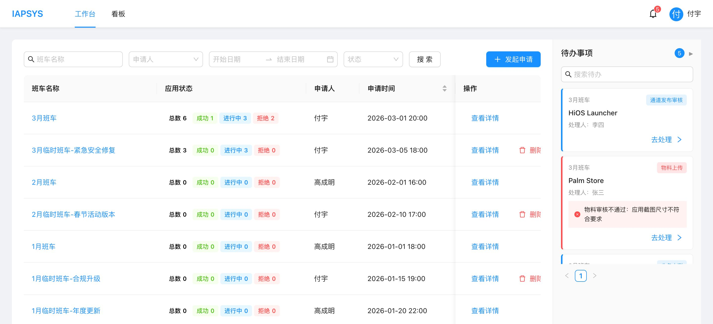

**功能要素：**

| 功能项 | 说明 |
|-------|------|
| 搜索 | 支持按流程单名称搜索 |
| 状态筛选 | 全部/进行中/已完成/已失败 |
| 新建流程单 | 点击「新建流程单」按钮，弹出创建弹窗 |
| 流程单卡片 | 展示名称、类型标签（月度/临时）、申请人、创建时间 |
| 状态统计 | 每个流程单卡片显示：总数、成功、进行中、拒绝 的应用数量 |
| 点击跳转 | 点击流程单卡片跳转至流程单详情页 |

**交互说明：**
- 流程单卡片采用列表形式排列
- 班车类型使用标签区分：月度班车（蓝色标签）、临时班车（橙色标签）
- 状态统计数值使用对应颜色高亮（成功=绿色，进行中=蓝色，拒绝=红色）

---

### 5.2 创建流程单

**触发方式：** 工作台页面点击「新建流程单」按钮

**功能描述：** 通过弹窗表单创建新的班车流程单。

#### 5.2.1 月度班车创建

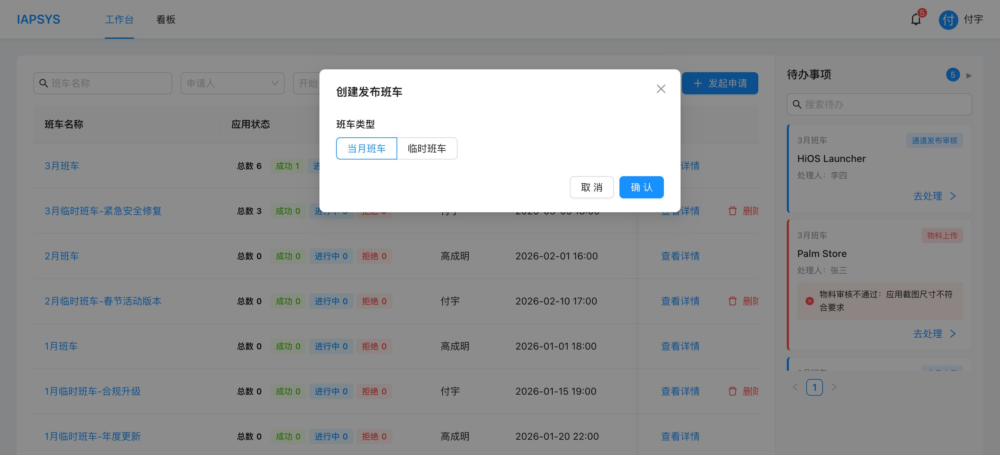

**表单字段：**

| 字段 | 类型 | 必填 | 说明 |
|------|------|------|------|
| 班车类型 | 单选 | 是 | 月度班车 / 临时班车 |
| 班车月份 | 月份选择器 | 是 | 仅月度班车显示，选择发布月份 |
| 流程单名称 | 输入框 | 是 | 自动生成格式：「{月份}班车」，可手动修改 |

#### 5.2.2 临时班车创建

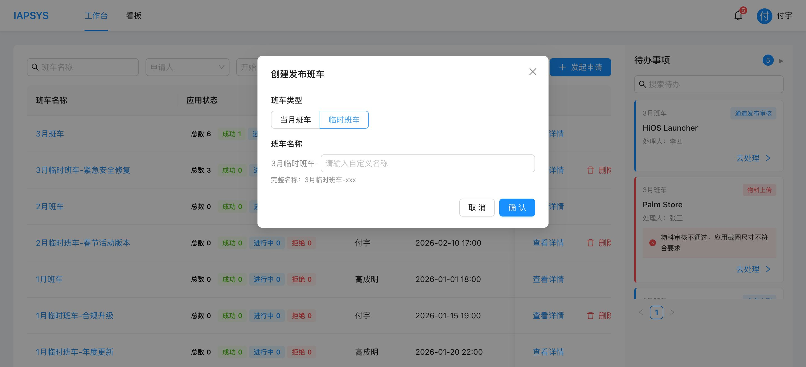

**表单字段：**

| 字段 | 类型 | 必填 | 说明 |
|------|------|------|------|
| 班车类型 | 单选 | 是 | 月度班车 / 临时班车 |
| 流程单名称 | 输入框 | 是 | 需手动填写名称 |

**交互说明：**
- 切换班车类型时，月份选择器动态显示/隐藏
- 选择月度班车时，流程单名称自动生成（如"3月班车"）
- 提交后跳转至新创建的流程单详情页

---

### 5.3 流程单详情

**页面路径：** `/workbench/flow/:flowId`

**功能描述：** 展示流程单下所有应用的列表，支持添加新应用、筛选和查看应用状态。

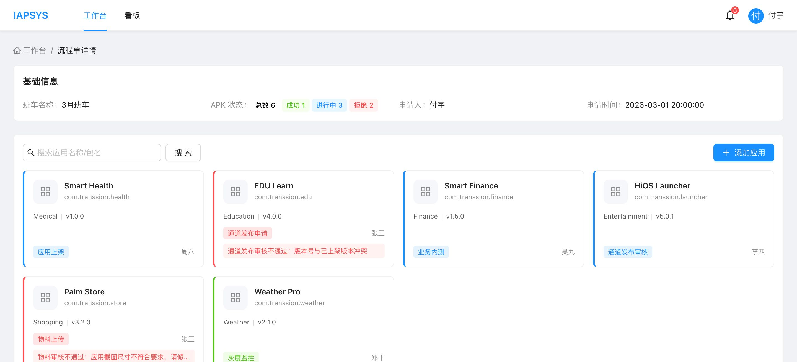

**功能要素：**

| 功能项 | 说明 |
|-------|------|
| 面包屑导航 | 工作台 > 流程单详情 |
| 流程单信息 | 流程单名称、类型标签、申请人、创建时间 |
| 添加应用按钮 | 点击弹出应用选择弹窗 |
| 搜索 | 支持按应用名称/包名搜索 |
| 状态筛选 | 全部/进行中/已完成/已驳回 |
| 应用表格 | 列：应用图标、应用名称、包名、应用类型、版本号、当前节点、状态、操作人、操作 |
| 操作列 | 「查看详情」链接跳转至 APK 发布详情页 |

**添加应用弹窗：**

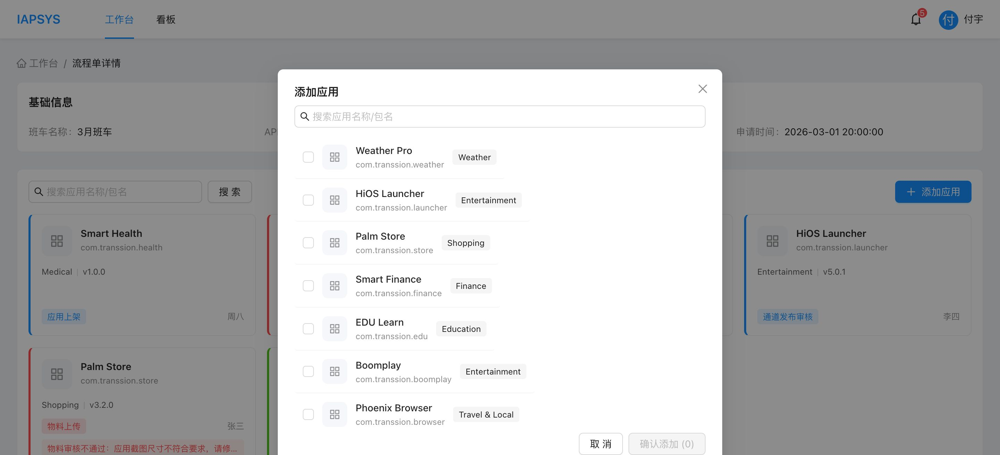

- 左侧展示可选应用列表（带搜索框）
- 勾选需要添加的应用（多选）
- 右侧展示已选应用（可移除）
- 确认后将选中的应用添加至当前流程单

---

### 5.4 APK 发布详情

**页面路径：** `/workbench/flow/:flowId/app/:appId`

**功能描述：** 展示单个应用的完整发布流程，包含 7 个节点的进度条和历史操作记录。

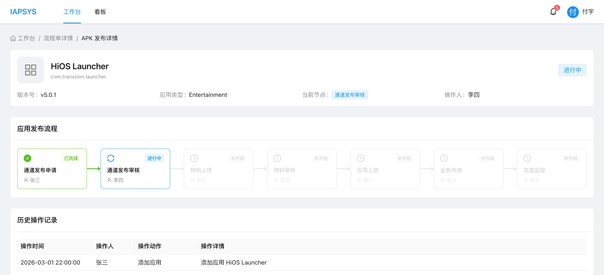

**功能要素：**

| 功能项 | 说明 |
|-------|------|
| 面包屑导航 | 工作台 > 流程单详情 > APK 发布详情 |
| 应用基本信息 | 应用图标、名称、包名、状态标签、版本号、应用类型、当前节点、操作人 |
| 7 节点流程进度条 | 水平展示 7 个节点，每个节点显示：状态图标、节点名称、负责人 |
| 节点点击 | 点击任一节点弹出对应的节点操作弹窗 |
| 历史操作记录 | 表格展示：操作时间、操作人、操作动作、操作详情 |

**节点状态图标：**
- 已完成：绿色 ✓ 图标
- 进行中：蓝色 🔄 图标
- 已驳回：红色 ✕ 图标
- 未开始：灰色 ⏱ 图标

**交互说明：**
- 流程进度条采用 Steps 组件横向展示
- 每个节点下方显示负责人姓名
- 点击节点弹出对应的 Modal 弹窗（根据节点类型加载不同组件）
- 当前节点高亮显示

---

### 5.5 通道发布申请

**节点类型：** `channel_apply`
**操作角色：** R01（应用创建申请人）
**触发方式：** 在 APK 发布详情页点击「通道发布申请」节点

**编辑模式截图：**

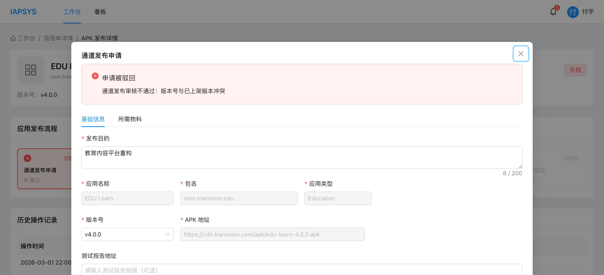

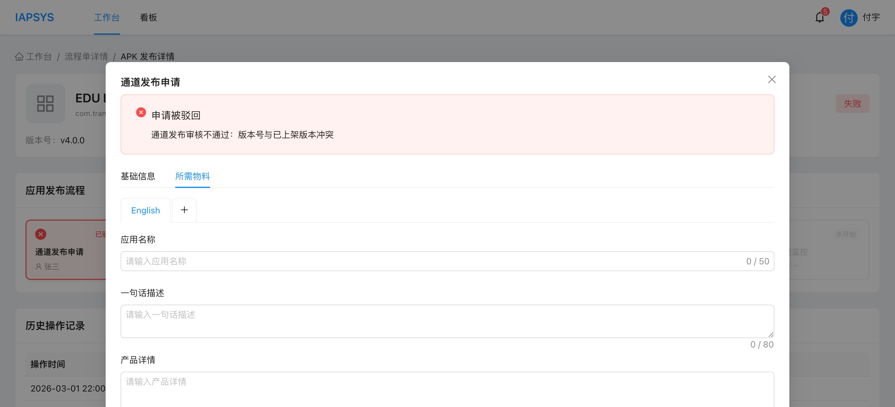

**弹窗结构：** 采用 Tabs 分为两个标签页

#### 5.5.1 基础信息 Tab

| 字段 | 类型 | 必填 | 说明 |
|------|------|------|------|
| 发布目的 | 多行文本 | 是 | 最多 200 字符，带字数统计 |
| 应用名称 | 输入框（禁用） | 是 | 自动带入，不可编辑 |
| 包名 | 输入框（禁用） | 是 | 自动带入，不可编辑 |
| 应用类型 | 输入框（禁用） | 是 | 自动带入，不可编辑 |
| 版本号 | 下拉选择 | 是 | 从应用版本列表获取，支持搜索，已使用版本不显示 |
| APK 地址 | 输入框（禁用） | 是 | 选择版本号后自动填入 |
| 测试报告地址 | 输入框 | 否 | 可选填写测试报告链接 |
| 应用分类 | 下拉选择 | 是 | 可选值见「应用分类枚举」 |
| 是否系统应用 | 单选 | 是 | 是 / 否 |
| 目标国家 | TypeSelector | 条件必填 | 全部/包含/不包含 + 多选国家列表 |
| 目标品牌 | TypeSelector | 条件必填 | 全部/包含/不包含 + 多选品牌列表 |
| 目标机型 | TypeSelector | 条件必填 | 全部/包含/不包含 + 多选机型列表 |
| 测试机型 | TypeSelector | 条件必填 | 全部/包含/不包含 + 多选机型列表 |
| 目标 Android 版本 | TypeSelector | 条件必填 | 全部/包含/不包含 + 多选 Android 版本 |
| tOS 版本 | TypeSelector | 条件必填 | 全部/包含/不包含，选项根据 Android 版本联动筛选 |
| 是否过滤印度 | 单选 | 是 | 是 / 否 |
| 是否 PA 更新 | 单选 | 是 | 是 / 否 |
| 灰度量级 | 数字输入 | 条件必填 | 仅在「是否 PA 更新=是」时显示，单位：万，范围 1~50000 |
| 生效时间 | 时间范围选择器 | 条件必填 | 仅在「是否 PA 更新=是」时显示，支持时分秒 |

**TypeSelector 组件说明：**

TypeSelector 是一个自定义复合选择组件，支持三种选择模式：
- **全部 (all)**：选择全部选项，不需要具体勾选
- **包含 (include)**：选择特定的值（白名单模式）
- **不包含 (exclude)**：排除特定的值（黑名单模式）

数据结构：
```typescript
interface TypeSelectorValue {
  type: 'all' | 'include' | 'exclude';
  values: string[];  // 选中的具体值（type=all 时为空数组）
}
```

**校验规则：**
- 选择「全部」时无需选择具体值，校验通过
- 选择「包含」或「不包含」时必须至少选择 1 个具体值

**tOS 版本联动规则：**
- tOS 版本列表根据已选 Android 版本动态筛选
- 每个 tOS 版本关联特定的 Android 版本（如 tOS 15.1.0 → Android 15）
- 当 Android 版本选择「全部」时，显示所有 tOS 版本

#### 5.5.2 所需物料 Tab

| 字段 | 类型 | 说明 |
|------|------|------|
| 语言选择 | Tab 切换 | 默认 English（不可删除），可添加其他语言 |
| 应用名称（多语言） | 输入框 | 各语言版本的应用名称 |
| 一句话描述 | 多行文本 | 最多 80 字符 |
| 产品详情 | 多行文本 | 最多 4000 字符 |
| 更新说明 | 多行文本 | 最多 500 字符 |
| 关键词 | 标签输入 | 支持添加多个关键词标签 |
| 应用图标 | 文件上传 | 上传应用图标 |
| 置顶大图 | 文件上传 | 上传置顶宣传大图 |
| 详情截图 | 文件上传（多张） | 上传详情截图，最少 3 张 |
| 是否 GP 上架 | 单选 | 是 / 否 |
| GP 链接 | 输入框 | 仅在「是否 GP 上架=是」时显示 |

**可选语言列表（Mock，后期从翻译系统实时获取）：**

| 语言代码 | 语言名称 | 是否可删除 |
|---------|---------|-----------|
| en | English | 否（默认必选） |
| ar | 阿拉伯语 | 是 |
| fr | 法语 | 是 |
| pt | 葡萄牙语 | 是 |
| sw | 斯瓦西里语 | 是 |
| am | 阿姆哈拉语 | 是 |
| om | 奥罗莫语 | 是 |
| ti | 提格雷语 | 是 |
| he | 希伯来语 | 是 |
| fa | 波斯语 | 是 |
| tr | 土耳其语 | 是 |
| ru | 俄罗斯语 | 是 |
| zh-TW | 中文繁体 | 是 |
| lo | 老挝语 | 是 |
| kk | 哈萨克语 | 是 |
| uk | 乌克兰语 | 是 |
| si | 僧伽罗语(斯里兰卡) | 是 |
| my | 缅甸语（官方） | 是 |
| my-zawgyi | 缅甸语（民间） | 是 |
| id | 印尼语 | 是 |
| th | 泰语 | 是 |
| vi | 越南语 | 是 |
| ne | 尼泊尔语 | 是 |
| tl | 菲律宾他加禄语 | 是 |
| km | 高棉语(柬埔寨) | 是 |
| ms | 马来语 | 是 |
| es-419 | 拉美西班牙语 | 是 |
| pt-BR | 拉丁葡语 | 是 |
| bn | 孟加拉语 | 是 |
| ur | 乌尔都语 | 是 |
| hi | 印地语 | 是 |
| gu | 古吉拉特语 | 是 |
| kn | 卡纳达语 | 是 |
| mr | 马拉地语 | 是 |
| pa | 旁遮普语 | 是 |
| ta | 泰米尔语 | 是 |
| te | 泰卢固语 | 是 |
| ml | 玛拉雅拉姆语 | 是 |
| as | 阿萨姆语 | 是 |
| ks | 克什米尔语 | 是 |
| or | 奥里亚语 | 是 |
| ku | 库尔德语 | 是 |
| ha | 豪萨文 | 是 |
| so | 索马里语 | 是 |
| cs | 捷克语 | 是 |
| sr-Latn | 塞尔维亚语（拉丁语） | 是 |
| bs-Latn | 波斯尼亚语（拉丁语） | 是 |
| cnr-Latn | 黑山语（拉丁语） | 是 |
| sq | 阿尔巴尼亚语（拉丁语） | 是 |
| mk | 北马其顿语（西里尔文） | 是 |
| de | 德语 | 是 |
| it | 意大利语 | 是 |
| el | 希腊语 | 是 |
| nl | 荷兰语 | 是 |
| ro | 罗马尼亚语 | 是 |
| sv | 瑞典语 | 是 |
| sk | 斯洛伐克语 | 是 |
| pl | 波兰语 | 是 |
| es | 西班牙语（欧洲版） | 是 |
| hu | 匈牙利语 | 是 |
| sl | 斯洛文尼亚语 | 是 |
| bg | 保加利亚语 | 是 |
| et | 爱沙尼亚语 | 是 |
| lv | 拉脱维亚语 | 是 |
| lt | 立陶宛语 | 是 |
| hr | 克罗地亚语 | 是 |
| da | 丹麦语 | 是 |
| no | 挪威语 | 是 |
| fi | 芬兰语 | 是 |
| is | 冰岛语 | 是 |
| lb | 卢森堡语 | 是 |
| uz | 乌兹别克语 | 是 |
| az | 阿塞拜疆语 | 是 |
| tg | 塔吉克语 | 是 |
| tk | 土库曼语 | 是 |
| ky | 吉尔吉斯斯坦 | 是 |
| mn | 蒙古语 | 是 |
| yo | 约鲁巴语 | 是 |
| ig | 伊博语 | 是 |
| ibb | 伊比比奥语 | 是 |
| efi | 埃菲克语 | 是 |
| ki | 基库尤语 | 是 |
| kam | 坎巴语 | 是 |
| luo | 卢奥语 | 是 |
| guz | 基西语 | 是 |
| mer | 梅鲁语 | 是 |
| pcm | 洋泾浜语 | 是 |
| ko | 韩语 | 是 |

> 共 88 种语言（含 English）。当前为 Mock 数据，后期将从翻译系统实时获取可选语言列表。

**交互说明：**
- 当节点状态为 `processing` 或 `rejected` 时显示编辑模式
- 被驳回时，弹窗顶部显示红色 Alert 框，展示驳回原因
- 支持 localStorage 自动保存草稿（防丢失，500ms 防抖）
- 提交成功后清除 localStorage 缓存
- 提交成功后自动推进至「通道发布审核」节点

---

### 5.6 通道发布审核

**节点类型：** `channel_review`
**操作角色：** R02（通道运营人员：付宇、高明成）、R03（老板：陈睿、朱锐）
**触发方式：** 在 APK 发布详情页点击「通道发布审核」节点

**截图：**

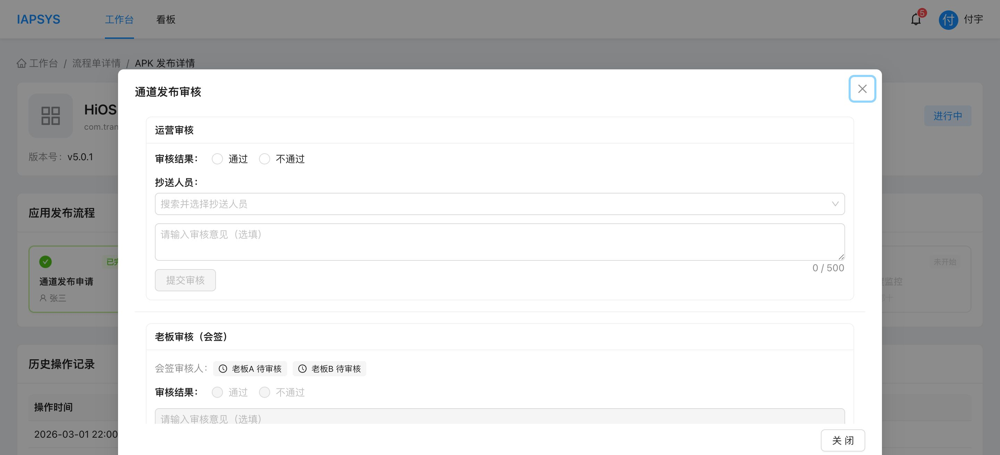

**弹窗结构：** 左右布局，左侧为申请详情只读展示，右侧为审核操作面板

```
┌────────────────────────────────────────────────────┐
│ Modal title: "通道发布审核"  width: 1400px          │
├──────────────────────────┬─────────────────────────┤
│                          │                         │
│  ChannelApplyReadonly    │  运营审核面板             │
│  （详情内容）             │  （审核结果/意见/抄送）    │
│                          │                         │
│  - 基础信息 Tab          │  老板会签面板             │
│  - 所需物料 Tab          │  （各老板独立审核状态）    │
│                          │                         │
│  宽度: ~60%              │  宽度: 420px            │
│  可独立滚动              │  可独立滚动              │
│                          │                         │
└──────────────────────────┴─────────────────────────┘
```

#### 5.6.1 运营审核面板

| 字段 | 类型 | 说明 |
|------|------|------|
| 审核结果 | 单选 | 通过 / 不通过 |
| 抄送人员 | 多选下拉 | 搜索并选择抄送人员 |
| 审核意见 | 多行文本 | 选填，最多 500 字符 |
| 提交审核按钮 | 按钮 | 提交审核结果 |

**运营审核规则：**
- 运营审核通过后，该面板变为只读状态
- 运营审核不通过：流程回退至「通道发布申请」，并附带驳回原因

#### 5.6.2 老板会签面板

| 字段 | 类型 | 说明 |
|------|------|------|
| 审核结果 | 单选 | 通过 / 不通过 |
| 审核意见 | 多行文本 | 选填，最多 500 字符 |
| 提交审核按钮 | 按钮 | 提交审核结果 |
| 会签审核人列表 | 独立卡片 | 每位老板独立展示审核状态、审核意见和审核时间 |

**会签审核人展示规则：**
- 每位老板独占一行卡片，包含：审核状态 Tag、审核时间、审核意见
- 卡片背景色区分状态：已通过（绿底 #f6ffed）、已拒绝（红底 #fff2f0）、待审核（灰底 #fafafa）
- 已审核的老板显示审核意见内容，待审核的老板仅显示「待审核」状态

**老板会签规则：**
- 老板会签面板在运营审核通过前处于禁用状态
- 采用会签机制：需所有老板（当前配置 2 位）全部通过才推进
- 当前配置的老板列表：陈睿 (U003)、朱锐 (U004)
- 任一老板驳回：流程回退至「通道发布申请」
- 所有老板通过：自动推进至「物料上传」

#### 5.6.3 详情展示区（左侧）

- 以 Tabs 展示通道发布申请的基础信息和物料信息（只读）
- 默认显示「基础信息」Tab
- 占据弹窗左侧大部分空间（flex: 1），可独立滚动

**交互说明：**
- 弹窗采用左右布局（display: flex），宽度 1400px
- 左侧详情区和右侧审核区各自独立滚动（overflowY: auto，maxHeight: 70vh）
- 左右两侧以 1px 竖线分隔（borderLeft）
- 运营审核支持抄送（CC）功能
- 节点完成后所有审核面板均为只读

---

### 5.7 物料上传

**节点类型：** `material_upload`
**操作角色：** R01（应用创建申请人）
**触发方式：** 在 APK 发布详情页点击「物料上传」节点

**截图：**

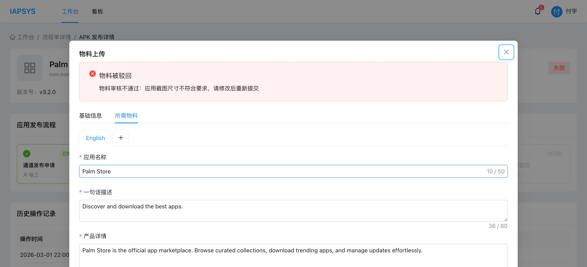

**弹窗结构：** 采用 Tabs 分为「基础信息」（只读）和「所需物料」（可编辑）

#### 5.7.1 基础信息 Tab
- 只读模式展示通道发布申请的基础信息
- 使用 Descriptions 组件以表格形式展示

#### 5.7.2 所需物料 Tab
- 继承通道发布申请中已填写的物料数据
- 物料上传者可在此基础上补充完善
- 各字段与「通道发布申请-所需物料」相同

**物料必填校验（提交时）：**

| 字段 | 校验规则 |
|------|---------|
| 应用名称（多语言） | 每种语言不能为空 |
| 一句话描述 | 每种语言不能为空 |
| 产品详情 | 每种语言不能为空 |
| 更新说明 | 每种语言不能为空 |
| 关键词 | 每种语言至少 1 个关键词 |
| 详情截图 | 每种语言至少 3 张截图 |

**交互说明：**
- 被驳回时顶部显示红色 Alert 框，展示驳回原因
- 提交时逐一校验每种语言的必填字段，不满足则弹出 Warning 提示具体哪种语言哪个字段未填
- 提交成功后自动推进至「物料审核」

---

### 5.8 物料审核

**节点类型：** `material_review`
**操作角色：** R02（通道运营人员：付宇、高明成）
**触发方式：** 在 APK 发布详情页点击「物料审核」节点

**截图：**

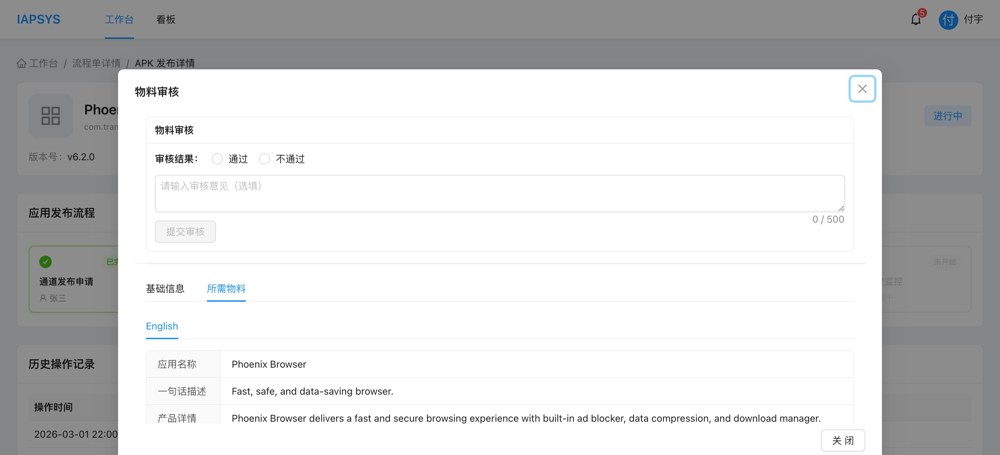

**弹窗结构：** 左右布局，左侧为通道发布申请 + 物料详情（只读），右侧为审核操作面板

```
┌────────────────────────────────────────────────────┐
│ Modal title: "物料审核"  width: 1400px              │
├──────────────────────────┬─────────────────────────┤
│                          │                         │
│  ChannelApplyReadonly    │  物料审核面板             │
│  （详情内容）             │  （审核结果/意见）        │
│                          │                         │
│  - 基础信息 Tab          │                         │
│  - 所需物料 Tab（默认）   │                         │
│                          │                         │
│  宽度: ~60%              │  宽度: 420px            │
│  可独立滚动              │  可独立滚动              │
│                          │                         │
└──────────────────────────┴─────────────────────────┘
```

**审核面板字段（右侧）：**

| 字段 | 类型 | 说明 |
|------|------|------|
| 审核结果 | 单选 | 通过 / 不通过 |
| 审核意见 | 多行文本 | 选填，最多 500 字符 |
| 提交审核按钮 | 按钮 | 提交审核结果 |

**审核规则：**
- 审核通过：自动推进至「应用上架」
- 审核不通过：流程回退至「物料上传」，并附带驳回原因

**详情展示区（左侧）：**
- 以 Tabs 展示：默认显示「所需物料」Tab
- 基础信息 Tab：通道发布申请的只读详情
- 所需物料 Tab：物料数据的只读展示（按语言切换）
- 占据弹窗左侧大部分空间（flex: 1），可独立滚动

**交互说明：**
- 弹窗采用左右布局（display: flex），宽度 1400px
- 左侧详情区和右侧审核区各自独立滚动（overflowY: auto，maxHeight: 70vh）
- 左右两侧以 1px 竖线分隔（borderLeft）
- 节点完成后审核面板变为只读

---

### 5.9 应用上架

**节点类型：** `app_publish`
**操作角色：** R02（通道运营人员：付宇、高明成）
**触发方式：** 在 APK 发布详情页点击「应用上架」节点

**截图：**

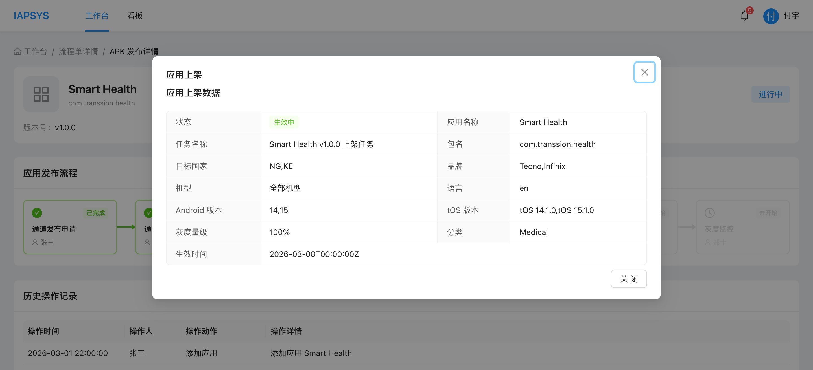

**弹窗内容：** 展示外部平台（应用上架平台）的数据，只读模式。

**展示字段：**

| 字段 | 说明 |
|------|------|
| 状态 | 生效中 / 已停用 |
| 应用名称 | 应用名称 |
| 任务名称 | 上架任务名称 |
| 包名 | 应用包名 |
| 目标国家 | 上架目标国家 |
| 品牌 | 目标品牌 |
| 机型 | 目标机型 |
| 语言 | 语言 |
| Android 版本 | 目标 Android 版本 |
| tOS 版本 | 目标 tOS 版本 |
| 灰度量级 | 灰度百分比 |
| 分类 | 应用分类 |
| 生效时间 | 生效时间 |

**交互说明：**
- 纯展示型弹窗，数据来源于外部平台接口
- 只有「关闭」按钮

---

### 5.10 业务内测

**节点类型：** `biz_test`
**操作角色：** R02（通道运营人员：付宇、高明成）、R01（应用创建申请人）
**触发方式：** 在 APK 发布详情页点击「业务内测」节点

**截图：**

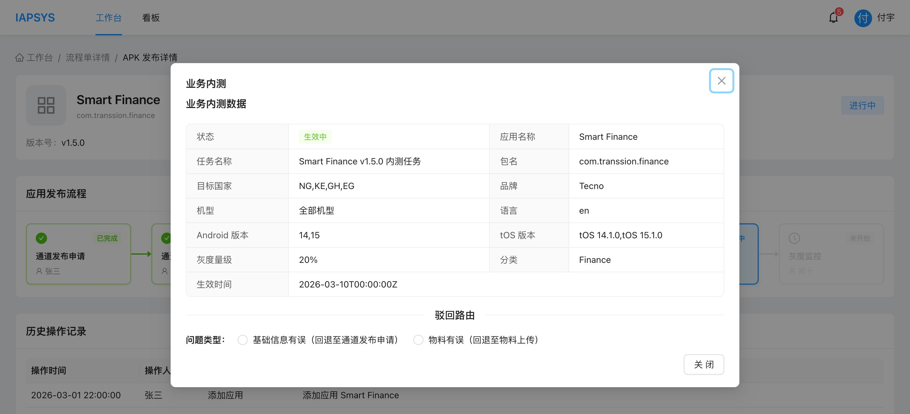

**弹窗内容：** 上部展示外部平台的业务内测数据，下部提供驳回路由功能。

**数据展示字段：** 与应用上架相同

**驳回路由功能：**

| 字段 | 类型 | 说明 |
|------|------|------|
| 问题类型 | 单选 | 基础信息有误（回退至通道发布申请） / 物料有误（回退至物料上传） |
| 驳回原因 | 多行文本 | 必填，最多 500 字符 |
| 确认驳回按钮 | 按钮 | 只有选择问题类型后才显示 |

**驳回路由规则：**
- 选择「基础信息有误」：流程回退至「通道发布申请」节点
- 选择「物料有误」：流程回退至「物料上传」节点
- 驳回原因为必填项
- 仅在节点状态为 `processing` 或 `rejected` 时显示驳回功能

---

### 5.11 灰度监控

**节点类型：** `gray_monitor`
**操作角色：** R02（通道运营人员：付宇、高明成）、R01（应用创建申请人）
**触发方式：** 在 APK 发布详情页点击「灰度监控」节点

**截图：**

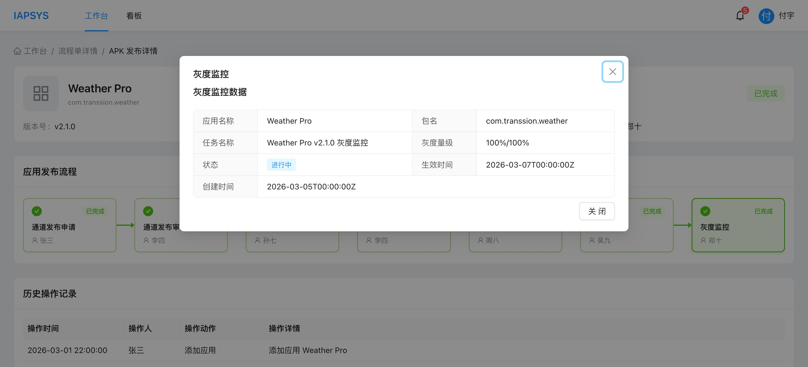

**弹窗内容：** 展示灰度监控平台的数据，只读模式。

**展示字段：**

| 字段 | 说明 |
|------|------|
| 应用名称 | 应用名称 |
| 包名 | 应用包名 |
| 任务名称 | 灰度监控任务名称 |
| 灰度量级 | 当前灰度比例（如 100%/100%） |
| 状态 | 进行中 / 已停用 |
| 生效时间 | 灰度生效时间 |
| 创建时间 | 监控任务创建时间 |

**交互说明：**
- 纯展示型弹窗
- 当灰度状态为「已停用」时，弹窗顶部显示红色 Alert 警告
- 只有「关闭」按钮

---

### 5.12 看板

**页面路径：** `/dashboard`

**功能描述：** 提供多维度的数据看板，支持三种视角查看发布情况。

#### 5.12.1 班车视角

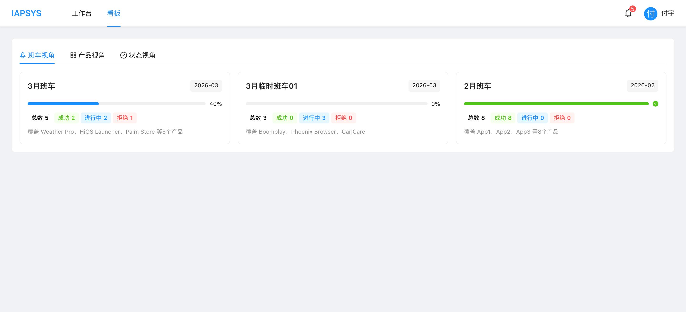

**展示内容：**
- 以班车为维度，展示每个班车的发布概况
- 每个班车卡片包含：
  - 班车名称
  - 发布月份
  - 状态统计（总数、成功、进行中、拒绝）
  - 覆盖的产品列表

#### 5.12.2 产品视角

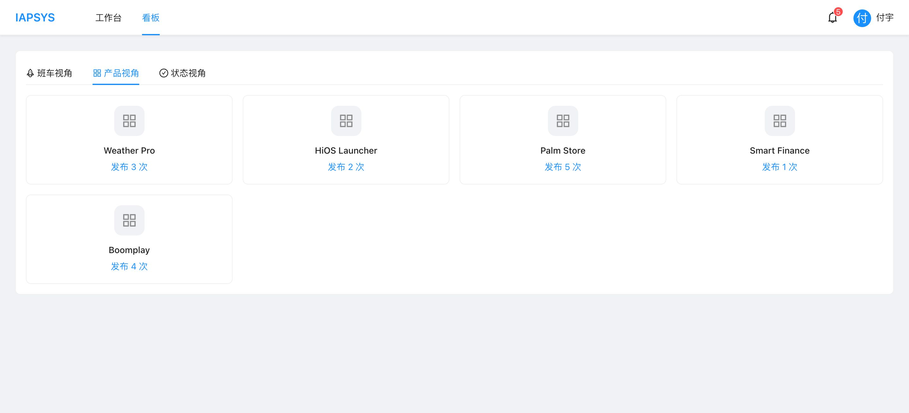

**展示内容：**
- 以产品（应用）为维度，展示每个产品的发布进度
- 展示所有产品的当前节点和状态

#### 5.12.3 状态视角

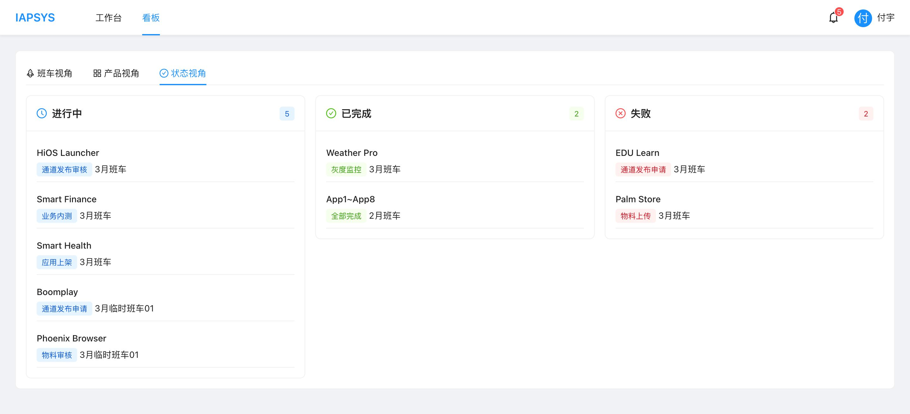

**展示内容：**
- 以节点状态为维度，汇总各节点的处理情况
- 展示各节点的待处理、进行中、已完成数量

---

## 6. 数据模型

### 6.1 流程单（FlowRecord）

```typescript
interface FlowRecord {
  id: string;               // 流程单 ID
  name: string;              // 流程单名称
  shuttleType: 'monthly' | 'temporary';  // 班车类型
  applicantId: string;       // 申请人 ID
  applicant: string;         // 申请人姓名
  createdAt: string;         // 创建时间
  statusSummary: {
    total: number;           // 应用总数
    success: number;         // 成功数
    processing: number;      // 进行中数
    rejected: number;        // 拒绝数
  };
}
```

### 6.2 应用记录（AppRecord）

```typescript
interface AppRecord {
  id: string;                // 应用记录 ID
  flowId: string;            // 所属流程单 ID
  appIcon: string;           // 应用图标 URL
  appName: string;           // 应用名称
  packageName: string;       // 包名
  appType: string;           // 应用类型
  versionCode: string;       // 版本号
  currentNode: NodeType;     // 当前节点类型
  currentNodeStatus: NodeStatus;  // 当前节点状态
  operator: string;          // 当前操作人
  rejectReason?: string;     // 驳回原因
  createdAt: string;         // 创建时间
}
```

### 6.3 流程节点（ProcessNode）

```typescript
interface ProcessNode {
  nodeId: string;            // 节点 ID
  recordId: string;          // 关联的应用记录 ID
  nodeType: NodeType;        // 节点类型
  nodeName: string;          // 节点名称
  nodeStatus: NodeStatus;    // 节点状态
  ownerId: string;           // 负责人 ID
  ownerName: string;         // 负责人姓名
  collaborators: Array<{ id: string; name: string }>;  // 协作人列表
  rejectReason?: string;     // 驳回原因
  startTime?: string;        // 开始时间
  completeTime?: string;     // 完成时间
  sortOrder: number;         // 排序顺序
}
```

### 6.4 通道发布申请数据（ChannelApplyFormData）

```typescript
interface ChannelApplyFormData {
  publishPurpose: string;              // 发布目的
  appName: string;                     // 应用名称
  packageName: string;                 // 包名
  appType: string;                     // 应用类型
  versionCode: string;                 // 版本号
  apkUrl: string;                      // APK 地址
  testReport?: string;                 // 测试报告地址
  appCategory: string;                 // 应用分类
  isSystemApp: boolean;                // 是否系统应用
  publishCountry: TypeSelectorValue;   // 目标国家
  publishBrand: TypeSelectorValue;     // 目标品牌
  publishModel: TypeSelectorValue;     // 目标机型
  testModel: TypeSelectorValue;        // 测试机型
  androidVersion: TypeSelectorValue;   // Android 版本
  tosVersion: TypeSelectorValue;       // tOS 版本
  filterIndia: boolean;                // 是否过滤印度
  isPaUpdate: boolean;                 // 是否 PA 更新
  grayScale?: number;                  // 灰度量级
  effectiveTimeRange?: [string, string]; // 生效时间范围
  materials: MaterialFormData[];       // 物料数据
  isGpPublish: boolean;                // 是否 GP 上架
  gpLink?: string;                     // GP 链接
}
```

### 6.5 物料数据（MaterialFormData）

```typescript
interface MaterialFormData {
  langCode: string;          // 语言代码
  langName: string;          // 语言名称
  appNameI18n: string;       // 多语言应用名称
  shortDesc: string;         // 一句话描述
  productDetail: string;     // 产品详情
  updateNote: string;        // 更新说明
  keywords: string[];        // 关键词列表
  iconUrl?: string;          // 应用图标 URL
  topImageUrl?: string;      // 置顶大图 URL
  screenshotUrls: string[];  // 详情截图 URL 列表
}
```

### 6.6 审核记录（ReviewRecord）

```typescript
interface ReviewRecord {
  reviewId: string;          // 审核记录 ID
  nodeId: string;            // 关联节点 ID
  reviewType: 'ops_review' | 'boss_sign' | 'material_review';  // 审核类型
  reviewerId: string;        // 审核人 ID
  reviewerName: string;      // 审核人姓名
  reviewResult: 'approved' | 'rejected' | null;  // 审核结果
  reviewComment?: string;    // 审核意见
  reviewTime: string | null; // 审核时间
}
```

### 6.7 类型选择器值（TypeSelectorValue）

```typescript
interface TypeSelectorValue {
  type: 'all' | 'include' | 'exclude';  // 选择模式
  values: string[];                       // 选中的具体值
}
```

---

## 7. API 接口设计

### 7.1 流程单相关

| 方法 | 路径 | 说明 |
|------|------|------|
| GET | `/api/v1/flows` | 获取流程单列表（分页、筛选） |
| POST | `/api/v1/flows` | 创建新流程单 |
| GET | `/api/v1/flows/:flowId` | 获取流程单详情 |

### 7.2 应用相关

| 方法 | 路径 | 说明 |
|------|------|------|
| GET | `/api/v1/flows/:flowId/apps` | 获取流程单下应用列表 |
| POST | `/api/v1/flows/:flowId/apps` | 添加应用到流程单 |
| GET | `/api/v1/apps/:appId` | 获取应用发布详情 |
| GET | `/api/v1/apps/:appId/versions` | 获取应用可用版本列表 |
| GET | `/api/v1/apps/available` | 获取可添加的应用列表 |

### 7.3 节点操作相关

| 方法 | 路径 | 说明 |
|------|------|------|
| GET | `/api/v1/nodes/:nodeId/channel-apply` | 获取通道发布申请数据 |
| POST | `/api/v1/nodes/:nodeId/channel-apply` | 提交通道发布申请 |
| GET | `/api/v1/nodes/:nodeId/materials` | 获取物料数据 |
| POST | `/api/v1/nodes/:nodeId/materials` | 提交物料数据 |
| GET | `/api/v1/nodes/:nodeId/reviews` | 获取审核记录列表 |
| POST | `/api/v1/nodes/:nodeId/reviews` | 提交审核结果 |
| GET | `/api/v1/nodes/:nodeId/external-data` | 获取外部平台数据（应用上架/业务内测） |
| GET | `/api/v1/nodes/:nodeId/gray-monitor` | 获取灰度监控数据 |
| POST | `/api/v1/nodes/:nodeId/advance` | 推进节点至下一步 |
| POST | `/api/v1/nodes/:nodeId/reject` | 驳回节点至指定目标 |

### 7.4 文件上传

| 方法 | 路径 | 说明 |
|------|------|------|
| POST | `/api/v1/upload` | 上传文件，返回文件 URL |

### 7.5 用户相关

| 方法 | 路径 | 说明 |
|------|------|------|
| GET | `/api/v1/user/current` | 获取当前登录用户信息 |

### 7.6 通知相关

| 方法 | 路径 | 说明 |
|------|------|------|
| POST | `/api/v1/notifications/feishu` | 发送飞书通知 |

### 7.7 看板相关

| 方法 | 路径 | 说明 |
|------|------|------|
| GET | `/api/v1/dashboard/shuttle` | 获取班车视角数据 |
| GET | `/api/v1/dashboard/product` | 获取产品视角数据 |
| GET | `/api/v1/dashboard/status` | 获取状态视角数据 |

---

## 8. 校验规则汇总

### 8.1 通道发布申请校验

| 字段 | 校验规则 |
|------|---------|
| 发布目的 | 必填，最多 200 字符 |
| 版本号 | 必填，从下拉列表选择 |
| 应用分类 | 必填，从下拉列表选择 |
| 是否系统应用 | 必填 |
| 目标国家/品牌/机型/测试机型/Android版本/tOS版本 | 选择「全部」时通过；选择「包含/不包含」时至少选择 1 个值 |
| 是否过滤印度 | 必填 |
| 是否 PA 更新 | 必填 |
| 灰度量级 | 「是 PA 更新」时必填，范围 1~50000 |
| 生效时间 | 「是 PA 更新」时必填 |

### 8.2 物料上传校验

| 字段 | 校验规则 |
|------|---------|
| 应用名称（各语言） | 必填，不能为空 |
| 一句话描述（各语言） | 必填，不能为空 |
| 产品详情（各语言） | 必填，不能为空 |
| 更新说明（各语言） | 必填，不能为空 |
| 关键词（各语言） | 必填，至少 1 个关键词 |
| 详情截图（各语言） | 必填，至少 3 张截图 |

### 8.3 审核校验

| 字段 | 校验规则 |
|------|---------|
| 审核结果 | 必选（通过/不通过） |
| 审核意见 | 选填，最多 500 字符 |

### 8.4 业务内测驳回校验

| 字段 | 校验规则 |
|------|---------|
| 问题类型 | 必选 |
| 驳回原因 | 必填，最多 500 字符 |

---

## 9. 状态扭转规则

### 9.1 节点类型与顺序

| 顺序 | 节点类型 | 节点名称 | 默认负责人 |
|------|---------|---------|-----------|
| 1 | channel_apply | 通道发布申请 | 应用创建申请人（R01） |
| 2 | channel_review | 通道发布审核 | 通道运营人员（R02） |
| 3 | material_upload | 物料上传 | 应用创建申请人（R01） |
| 4 | material_review | 物料审核 | 通道运营人员（R02） |
| 5 | app_publish | 应用上架 | 通道运营人员（R02） |
| 6 | biz_test | 业务内测 | 通道运营人员（R02） |
| 7 | gray_monitor | 灰度监控 | 通道运营人员（R02） |

### 9.2 正向推进规则（Advance）

| 当前节点 | 触发条件 | 推进至 |
|---------|---------|-------|
| 通道发布申请 | 提交申请成功 | 通道发布审核 |
| 通道发布审核 | 运营审核通过 + 所有老板会签通过 | 物料上传 |
| 物料上传 | 提交物料（校验通过）成功 | 物料审核 |
| 物料审核 | 审核通过 | 应用上架 |
| 应用上架 | 外部平台确认上架 | 业务内测 |
| 业务内测 | 测试无问题 | 灰度监控 |
| 灰度监控 | 灰度完成 | 流程结束（completed） |

### 9.3 驳回规则（Reject）

| 驳回发起节点 | 驳回目标节点 | 驳回原因 |
|-------------|-------------|---------|
| 通道发布审核（运营不通过） | 通道发布申请 | 运营审核不通过：{审核意见} |
| 通道发布审核（老板不通过） | 通道发布申请 | 老板审核不通过：{审核意见} |
| 物料审核（不通过） | 物料上传 | 物料审核不通过：{审核意见} |
| 业务内测（基础信息有误） | 通道发布申请 | 业务内测驳回：{驳回原因} |
| 业务内测（物料有误） | 物料上传 | 业务内测驳回：{驳回原因} |

### 9.4 状态变化说明

**正向推进时：**
- 当前节点状态变为 `completed`
- 下一节点状态变为 `processing`
- 应用 `currentNode` 更新为下一节点
- 应用 `operator` 更新为下一节点负责人

**驳回时：**
- 当前节点状态不变
- 目标节点状态变为 `rejected`
- 应用 `currentNode` 更新为目标节点
- 应用 `currentNodeStatus` 更新为 `rejected`
- 应用 `rejectReason` 记录驳回原因

---

## 10. 飞书通知

### 10.1 通知概述

系统在关键业务节点自动发送飞书通知，确保相关人员及时获知流程进展并采取行动。通知采用 **fire-and-forget** 模式——通知发送失败不会阻塞业务流程。

### 10.2 通知触发点汇总

| 序号 | 触发场景 | 触发时机 | 通知对象 | 抄送对象 |
|------|---------|---------|---------|---------|
| 1 | 班车创建 | 通道运营人员创建班车确认后 | 应用创建申请人(R01) | - |
| 2 | 通道发布申请提交 | 通道发布申请填写确认后 | 通道运营人员(R02) | - |
| 3 | 运营审核驳回 | 通道发布审核运营审核不通过后 | 应用创建申请人(R01) | - |
| 4 | 运营审核通过 | 通道发布审核运营审核通过后 | 老板(R03) | - |
| 5 | 老板审核驳回 | 通道发布审核老板审核不通过后 | 应用创建申请人(R01) | - |
| 6 | 老板会签全部通过 | 最后一位老板审核通过后 | 应用创建申请人(R01) | - |
| 7 | 物料上传提交 | 物料上传填写确认后 | 通道运营人员(R02) | - |
| 8 | 物料审核驳回 | 物料审核不通过后 | 应用创建申请人(R01) | - |
| 9 | 应用上架结果 | 物料审核通过推进至应用上架后 | 通道运营人员(R02) | - |
| 10 | 业务内测失败 | 业务内测驳回后 | 应用创建申请人(R01) | 通道运营人员(R02) |
| 11 | 业务内测通过 | 业务内测通过推进至灰度监控后 | 通道运营人员(R02) | - |

### 10.3 通知详细设计

#### 10.3.1 班车创建通知

**触发条件：** 通道运营人员/老板创建发布班车并点击确认后
**通知对象：** 所有应用创建申请人（R01）
**目的：** 通知各应用负责人在班车中添加自己需要发布的应用

> **飞书消息模板（待填写）**
>
> 标题：`[待填写]`
>
> 内容：
> ```
> [待填写]
>
> 可用变量：
> - {{shuttleName}} - 班车名称
> - {{creatorName}} - 创建人姓名
> - {{createTime}} - 创建时间
> ```

---

#### 10.3.2 通道发布申请提交通知

**触发条件：** 应用创建申请人在通道发布申请中填写并确认提交后
**通知对象：** 所有通道运营人员（R02：付宇、高明成）
**目的：** 通知通道运营人员进行审核

> **飞书消息模板（待填写）**
>
> 标题：`[待填写]`
>
> 内容：
> ```
> [待填写]
>
> 可用变量：
> - {{appName}} - 应用名称
> - {{applicantName}} - 申请人姓名
> - {{submitTime}} - 提交时间
> - {{shuttleName}} - 所属班车名称
> ```

---

#### 10.3.3 运营审核驳回通知

**触发条件：** 通道运营人员在通道发布审核中审核不通过后
**通知对象：** 应用创建申请人（R01）
**目的：** 通知申请人进行通道发布申请修改

> **飞书消息模板（待填写）**
>
> 标题：`[待填写]`
>
> 内容：
> ```
> [待填写]
>
> 可用变量：
> - {{appName}} - 应用名称
> - {{reviewerName}} - 审核人姓名
> - {{rejectReason}} - 驳回原因
> - {{rejectTime}} - 驳回时间
> ```

---

#### 10.3.4 运营审核通过通知

**触发条件：** 通道运营人员在通道发布审核中审核通过后
**通知对象：** 所有老板（R03：陈睿、朱锐）
**目的：** 通知老板进行会签审核

> **飞书消息模板（待填写）**
>
> 标题：`[待填写]`
>
> 内容：
> ```
> [待填写]
>
> 可用变量：
> - {{appName}} - 应用名称
> - {{opsReviewerName}} - 运营审核人姓名
> - {{approveTime}} - 通过时间
> ```

---

#### 10.3.5 老板审核驳回通知

**触发条件：** 老板在通道发布审核会签中审核不通过后
**通知对象：** 应用创建申请人（R01）
**目的：** 通知申请人进行修改

> **飞书消息模板（待填写）**
>
> 标题：`[待填写]`
>
> 内容：
> ```
> [待填写]
>
> 可用变量：
> - {{appName}} - 应用名称
> - {{bossName}} - 老板姓名
> - {{rejectReason}} - 驳回原因
> - {{rejectTime}} - 驳回时间
> ```

---

#### 10.3.6 老板会签全部通过通知

**触发条件：** 老板会签中最后一位老板审核通过后（所有老板均已通过）
**通知对象：** 应用创建申请人（R01）
**目的：** 通知申请人进行物料上传

> **飞书消息模板（待填写）**
>
> 标题：`[待填写]`
>
> 内容：
> ```
> [待填写]
>
> 可用变量：
> - {{appName}} - 应用名称
> - {{approveTime}} - 全部通过时间
> - {{bossList}} - 审核通过的老板列表
> ```

---

#### 10.3.7 物料上传提交通知

**触发条件：** 应用创建申请人在物料上传中填写确认提交后
**通知对象：** 所有通道运营人员（R02：付宇、高明成）
**目的：** 通知通道运营人员进行物料审核

> **飞书消息模板（待填写）**
>
> 标题：`[待填写]`
>
> 内容：
> ```
> [待填写]
>
> 可用变量：
> - {{appName}} - 应用名称
> - {{uploaderName}} - 上传人姓名
> - {{submitTime}} - 提交时间
> - {{languageCount}} - 物料语言数量
> ```

---

#### 10.3.8 物料审核驳回通知

**触发条件：** 通道运营人员在物料审核中审核不通过后
**通知对象：** 应用创建申请人（R01）
**目的：** 通知申请人进行物料上传修改

> **飞书消息模板（待填写）**
>
> 标题：`[待填写]`
>
> 内容：
> ```
> [待填写]
>
> 可用变量：
> - {{appName}} - 应用名称
> - {{reviewerName}} - 审核人姓名
> - {{rejectReason}} - 驳回原因
> - {{rejectTime}} - 驳回时间
> ```

---

#### 10.3.9 应用上架结果通知

**触发条件：** 物料审核通过后，应用推进至应用上架节点
**通知对象：** 所有通道运营人员（R02：付宇、高明成）
**目的：** 通知运营人员关注应用上架状态

> **飞书消息模板（待填写）**
>
> 标题：`[待填写]`
>
> 内容：
> ```
> [待填写]
>
> 可用变量：
> - {{appName}} - 应用名称
> - {{publishResult}} - 上架结果（成功/失败）
> - {{publishTime}} - 上架时间
> ```

---

#### 10.3.10 业务内测失败通知

**触发条件：** 业务内测驳回后（基础信息有误或物料有误）
**通知对象：** 应用创建申请人（R01）
**抄送对象：** 所有通道运营人员（R02：付宇、高明成）
**目的：** 通知申请人进行修改，抄送运营人员知晓

> **飞书消息模板（待填写）**
>
> 标题：`[待填写]`
>
> 内容：
> ```
> [待填写]
>
> 可用变量：
> - {{appName}} - 应用名称
> - {{rejectType}} - 驳回类型（基础信息有误/物料有误）
> - {{rejectReason}} - 驳回原因
> - {{rejectTarget}} - 回退目标节点
> - {{rejectTime}} - 驳回时间
> ```

---

#### 10.3.11 业务内测通过通知

**触发条件：** 业务内测通过，推进至灰度监控后
**通知对象：** 所有通道运营人员（R02：付宇、高明成）
**目的：** 通知运营人员业务内测已通过

> **飞书消息模板（待填写）**
>
> 标题：`[待填写]`
>
> 内容：
> ```
> [待填写]
>
> 可用变量：
> - {{appName}} - 应用名称
> - {{passTime}} - 通过时间
> ```

---

### 10.4 通知 API 接口

| 方法 | 路径 | 说明 |
|------|------|------|
| POST | `/api/v1/notifications/feishu` | 发送飞书通知 |

**请求参数：**

```typescript
interface FeishuNotificationPayload {
  type: FeishuNotificationType;  // 通知类型（11 种枚举值）
  shuttleName?: string;           // 班车名称
  appName?: string;               // 应用名称
  recipients: string[];           // 接收人 userId 列表
  ccList?: string[];              // 抄送人 userId 列表
  extra?: Record<string, string>; // 附加信息（如驳回原因）
}
```

### 10.5 实现说明

- 通知采用 **fire-and-forget** 模式：发送通知后不等待响应，通知发送失败不会阻塞业务流程
- 前端在业务操作成功后异步调用通知接口
- 当前阶段使用 MSW Mock，控制台输出通知内容以便调试
- 后期对接真实飞书 API 时，由后端服务实现通知发送逻辑

---

## 11. 非功能性需求

### 11.1 性能要求

| 指标 | 要求 |
|------|------|
| 页面首屏加载 | ≤ 2 秒 |
| API 响应时间 | ≤ 500ms（列表接口 ≤ 1s） |
| 文件上传 | 支持最大 50MB |
| 并发用户 | 支持 100+ 并发 |

### 11.2 浏览器兼容性

| 浏览器 | 最低版本 |
|-------|---------|
| Chrome | 90+ |
| Firefox | 88+ |
| Edge | 90+ |
| Safari | 14+ |

### 11.3 安全要求

- 所有 API 需要登录鉴权
- 节点操作基于 `NODE_CONFIG.editRoles` 进行角色权限控制，非权限人员仅可查看不可操作
- 文件上传需要类型和大小限制
- XSS/CSRF 防护

### 11.4 数据一致性

- 节点状态扭转需保证原子性
- 审核操作需记录完整审计日志
- localStorage 草稿保存需与服务端数据合理冲突处理

---

## 附录

### A. 应用分类枚举

| 值 | 显示名称 |
|---|---------|
| travel_local | Travel & Local |
| shopping | Shopping |
| entertainment | Entertainment |
| finance | Finance |
| business | Business |
| weather | Weather |
| social | Social |
| education | Education |
| medical | Medical |
| auto_vehicles | Auto & Vehicles |

### B. 品牌枚举

| 值 | 显示名称 |
|---|---------|
| Tecno | Tecno |
| Infinix | Infinix |
| itel | itel |

### C. Android 版本枚举

Android 11 ~ Android 16

### D. tOS 版本枚举与 Android 版本映射

| tOS 版本 | 对应 Android 版本 |
|---------|------------------|
| tOS 16.1.0 | Android 16 |
| tOS 16.0.0 | Android 16 |
| tOS 15.2.0 | Android 15 |
| tOS 15.1.0 | Android 15 |
| tOS 14.1.0 | Android 14 |
| tOS 13.0.0 | Android 13 |
| tOS 12.0.0 | Android 12 |
| tOS 11.0.0 | Android 11 |

### E. 国家枚举

中国(CN)、印度(IN)、尼日利亚(NG)、肯尼亚(KE)、坦桑尼亚(TZ)、加纳(GH)、埃及(EG)、印度尼西亚(ID)、巴基斯坦(PK)、孟加拉国(BD)、菲律宾(PH)、越南(VN)、巴西(BR)、墨西哥(MX)、俄罗斯(RU)

### F. 机型枚举

| 机型 | 品牌 |
|------|------|
| X6841_H6941 | Tecno |
| X6858_H8917 (Android 16) | Tecno |
| KO5_H8925 | Tecno |
| X6838_H6939 | Infinix |
| X6876_H8921 | Infinix |
| P682L_H8935 | itel |

### G. 节点状态颜色

| 状态 | 颜色 | 色值 |
|------|------|------|
| 未开始 | 灰色 | #D9D9D9 |
| 进行中 | 蓝色 | #1890FF |
| 已完成 | 绿色 | #52C41A |
| 已驳回 | 红色 | #FF4D4F |
